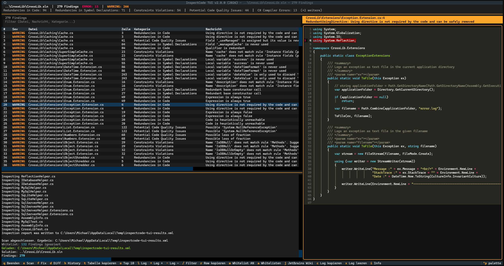
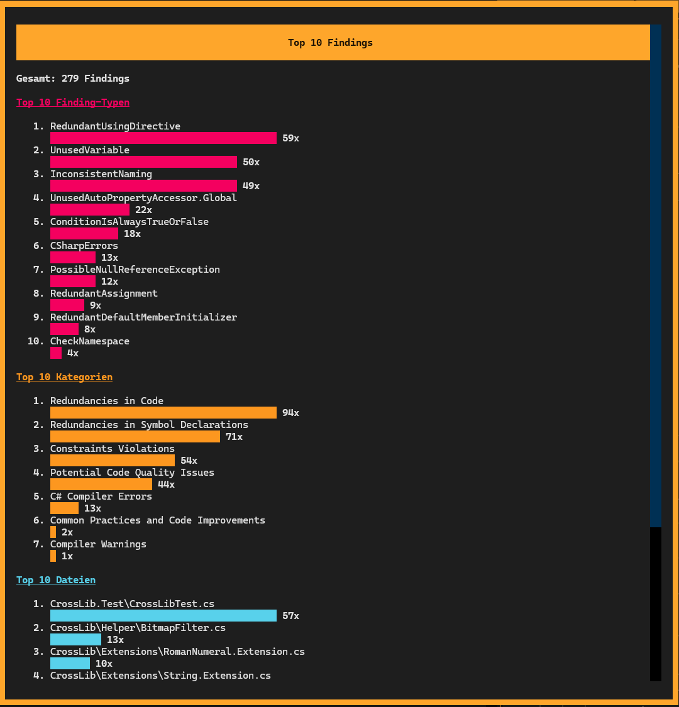
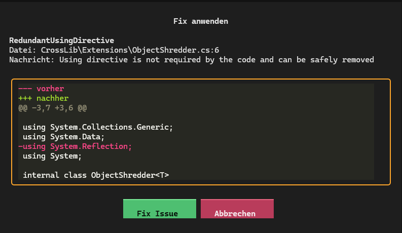
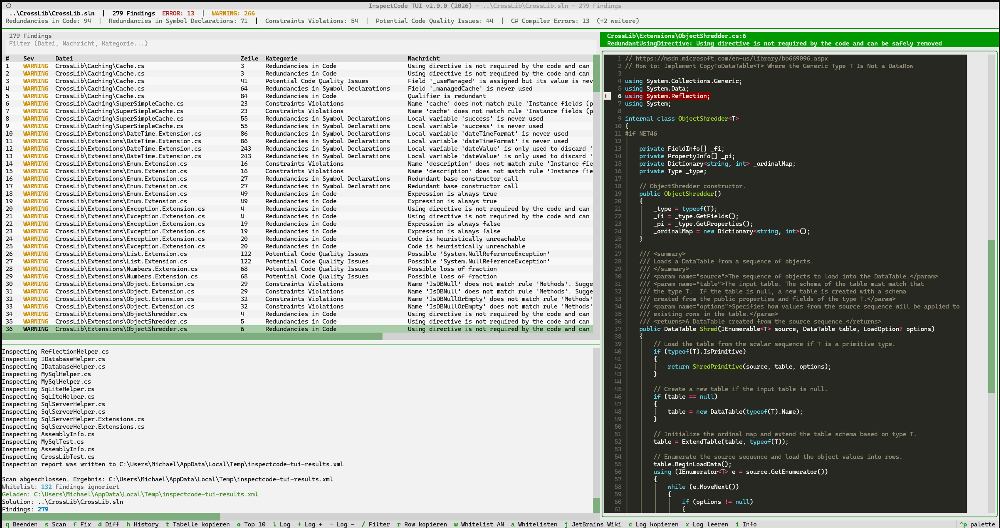
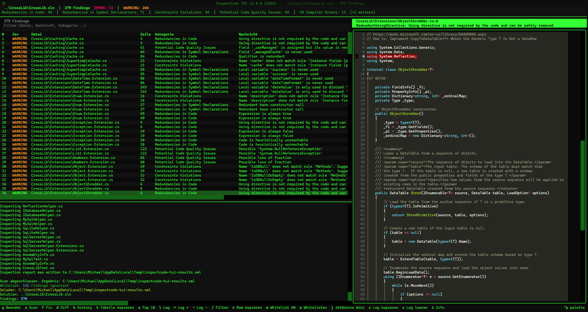

# InspectCode TUI

[](https://github.com/michaelblaess/inspectcode-tui/stargazers)
[](https://github.com/michaelblaess/inspectcode-tui/network/members)
[](https://github.com/michaelblaess/inspectcode-tui/issues)
[](https://github.com/michaelblaess/inspectcode-tui/pulls)

[](https://github.com/michaelblaess/inspectcode-tui/commits/main)
[](LICENSE)
[](https://www.python.org/)

Terminal-UI zum Durchsuchen und Beheben von C# und .NET-Problemen mit [InspectCode](https://www.jetbrains.com/help/resharper/InspectCode.html) von JetBrains.

A terminal user interface for browsing and fixing C# and .NET issues with [InspectCode](https://www.jetbrains.com/help/resharper/InspectCode.html) by JetBrains.

Gebaut mit / Built with [Textual](https://textual.textualize.io/) and [Rich](https://rich.readthedocs.io/).


*Findings-Tabelle, Quellcode mit Syntax-Highlighting, Log*

| | |
|---|---|
|  |  |
| *Top 10 — Finding-Typen, Kategorien, Dateien* | *Auto-Fix mit Diff-Vorschau* |

| | |
|---|---|
|  |  |
| *Gemstone — Monochromer GEM Desktop* | *Classic Terminal — Phosphor-Gruen* |

---

- [Deutsch](#deutsch)
- [English](#english)

---

# Deutsch

## Warum InspectCode?

Linter wie ESLint, StyleCop oder `dotnet format` prüfen **Stil und Syntax** - Namenskonventionen, fehlende Klammern, unbenutzte Imports. Das ist nützlich, aber es kratzt nur an der Oberfläche.

JetBrains InspectCode (die Engine hinter ReSharper) macht **tiefgehende statische Analyse** deines .NET-Codes. Es versteht dein Typsystem, den Kontrollfluss und den Datenfluss und findet Bugs, die kein Linter erkennt:

- **Null-Referenz-Pfade** - "diese Variable *kann* hier null sein, und du prüfst nicht"
- **Toter Code** - "diese Bedingung ist immer false, dieser Zweig wird nie ausgeführt"
- **Mögliche InvalidOperationException** - "dieser `.Value`-Zugriff auf ein Nullable wirft zur Laufzeit"
- **Mehrfache Enumeration** - "du iterierst dieses `IEnumerable` zweimal, was unerwartetes Verhalten oder Performance-Probleme verursachen kann"
- **Virtuelle Aufrufe in Konstruktoren** - "dieser überschreibbare Methodenaufruf im Konstruktor verhält sich in abgeleiteten Klassen anders"

Das sind **Laufzeit-Bugs auf Abruf**, die jeden Linter, jede Compiler-Warnung und jedes Code-Review passieren. InspectCode findet sie, bevor es deine User tun.

Das Problem: InspectCode produziert einen rohen Report (XML oder SARIF/JSON) mit Hunderten von Findings. Hier kommt dieses Tool ins Spiel - es gibt dir eine interaktive Terminal-UI zum Durchsuchen, Filtern, Inspizieren und Beheben dieser Findings.

## Features

- **Horizontal-Split-Layout** - Findings-Tabelle links, Quellcode mit Syntax-Highlighting rechts
- **Findings durchsuchen** in einer filterbaren Tabelle mit Severity-Farben
- **Quellcode-Ansicht** mit automatischem Sprung zur betroffenen Zeile
- **`jb inspectcode` direkt starten** aus der TUI heraus mit Live-Log und Fortschrittsanzeige
- **Git-Commit-Modus** - nur geänderte Dateien seit einem Commit scannen (`--commit HEAD~1`)
- **Auto-Fix** für 11 Issue-Typen mit Diff-Vorschau vor dem Anwenden
- **History** - letzte Scan-Parameter merken und wiederverwenden
- **Top 10 Chart** - häufigste Finding-Typen, Kategorien und Dateien auf einen Blick
- **31 Retro-Themes** - via Theme-Picker (Ctrl+P), siehe [textual-themes](https://github.com/michaelblaess/textual-themes)
- **Whitelist** - bekannte Issues per `whitelist.json` ignorieren, Ein/Aus-Toggle und Hinzufügen direkt in der TUI
- **Settings-Persistenz** - Theme, Log-Höhe und Sichtbarkeit werden gespeichert
- **Mehrsprachig** - Deutsch und Englisch, umschaltbar mit `--lang en`
- **.sln und .csproj** - beide Projekttypen werden unterstützt
- **XML und SARIF/JSON** - beide InspectCode-Ausgabeformate werden automatisch erkannt

## Voraussetzungen

- **Python 3.10+**
- **JetBrains CLI Tools** (`jb inspectcode`) - installieren mit:
  ```bash
  dotnet tool install -g JetBrains.ReSharper.GlobalTools
  ```

## Installation

### One-Click-Install (Standalone, kein Python nötig)

**Windows (PowerShell):**
```powershell
irm https://raw.githubusercontent.com/michaelblaess/inspectcode-tui/main/install.ps1 | iex
```

**Linux / macOS:**
```bash
curl -fsSL https://raw.githubusercontent.com/michaelblaess/inspectcode-tui/main/install.sh | bash
```

### Aus Quellcode (Python 3.10+)

```bash
git clone https://github.com/michaelblaess/inspectcode-tui.git
cd inspectcode-tui
pip install -e .
```

## Verwendung

```bash
# Live-Scan einer Solution starten
inspectcode-tui "C:\Pfad\zu\MeineSolution.sln"

# Einzelnes .csproj scannen
inspectcode-tui "C:\Pfad\zu\MeinProjekt.csproj"

# Nur ein bestimmtes Projekt innerhalb der Solution scannen
inspectcode-tui "MeineSolution.sln" --project="MeinProjekt"

# Nur geänderte Dateien seit letztem Commit scannen (Git-Modus)
inspectcode-tui "MeineSolution.sln" --commit HEAD~1

# Vorhandene Report-Datei laden (kein Scan nötig)
inspectcode-tui --xml="C:\Temp\inspectcode-results.xml"

# Nach minimaler Severity filtern
inspectcode-tui --xml="report.xml" --severity=ERROR

# Vor dem Scan bauen (Standard: --no-build)
inspectcode-tui "MeineSolution.sln" --build

# Englische Oberfläche
inspectcode-tui "MeineSolution.sln" --lang en

# Ohne Argumente starten (History-Auswahl)
inspectcode-tui
```

> **Tipp:** Schließe Visual Studio bevor du einen Live-Scan startest, um Dateisperren zu vermeiden.
> Die gewählte Sprache wird gespeichert und beim nächsten Start automatisch verwendet.

## Tastenkürzel

| Taste     | Aktion                                  |
|-----------|-----------------------------------------|
| `s`       | Scan starten                            |
| `f`       | Fix anwenden (nur bei fixbaren Issues)  |
| `d`       | Diff-Vorschau (nur bei fixbaren Issues) |
| `w`       | Whitelist AN/AUS                        |
| `a`       | Finding zur Whitelist hinzufügen        |
| `j`       | JetBrains Wiki-Seite öffnen            |
| `h`       | History-Dialog                          |
| `o`       | Top-10-Chart                            |
| `r`       | Aktuelle Zeile kopieren                 |
| `t`       | Gesamte Tabelle kopieren               |
| `/`       | Filter fokussieren                      |
| `Escape`  | Filter leeren                           |
| `l`       | Log ein-/ausblenden                     |
| `+` / `-` | Log vergrößern / verkleinern           |
| `c`       | Log kopieren                            |
| `x`       | Log leeren                              |
| `i`       | Info/About                              |
| `Ctrl+P`  | Theme wechseln                          |
| `q`       | Beenden                                 |

## Automatisch behebbare Issue-Typen

| Issue-Typ | Fix |
|---|---|
| `RedundantUsingDirective` | Zeile entfernen |
| `UnusedVariable` | Zeile entfernen |
| `RedundantAssignment` | Zeile entfernen |
| `HeuristicUnreachableCode` | Zeile entfernen |
| `EmptyConstructor` | Konstruktor-Block entfernen |
| `RedundantBaseConstructorCall` | `: base()` entfernen |
| `RedundantDefaultMemberInitializer` | `= 0` / `= null` / `= false` / `= default` entfernen |
| `PossibleIntendedRethrow` | `throw ex;` durch `throw;` ersetzen |
| `RedundantBaseQualifier` | `base.` Prefix entfernen |
| `ConstantConditionalAccessQualifier` | `?.` durch `.` ersetzen |
| `StringIndexOfIsCultureSpecific.1` | `StringComparison.Ordinal` hinzufügen |

Weitere Fix-Strategien können in `src/inspectcode_tui/services/fixer.py` ergänzt werden.

## So funktioniert es

1. **InspectCode** analysiert deine .NET-Solution und schreibt einen Report (XML oder SARIF/JSON)
2. **inspectcode-tui** erkennt das Format automatisch und parst es in strukturierte `Finding`-Objekte
3. Findings werden in einer **DataTable** mit Severity-Farben und Filterung angezeigt
4. Beim Navigieren wird automatisch der **Quellcode** mit markierter Zeile rechts angezeigt
5. Für behebbare Issues kannst du den **Diff vorab ansehen** und den Fix per Tastendruck anwenden
6. Git ist dein Sicherheitsnetz - alle Änderungen können jederzeit mit `git checkout` rückgängig gemacht werden

---

# English

## Why InspectCode?

Linters like ESLint, StyleCop or `dotnet format` check **style and syntax** - things like naming conventions, missing braces, or unused imports. That's useful, but it's surface-level.

JetBrains InspectCode (the engine behind ReSharper) does **deep static analysis** of your .NET code. It understands your type system, control flow, and data flow to find bugs that no linter can catch:

- **Null reference paths** - "this variable *can* be null here, and you're not checking"
- **Dead code detection** - "this condition is always false, so this branch never executes"
- **Possible InvalidOperationException** - "this `.Value` call on a nullable will throw at runtime"
- **Multiple enumeration** - "you're iterating this `IEnumerable` twice, which may cause unexpected behavior or performance issues"
- **Virtual calls in constructors** - "this overridable method call in a constructor will behave differently in derived classes"

These are **runtime bugs waiting to happen** that pass every linter, every compiler warning, and every code review. InspectCode finds them before your users do.

The problem: InspectCode produces a raw report (XML or SARIF/JSON) with hundreds of findings. That's where this tool comes in - it gives you an interactive terminal UI to browse, filter, inspect, and fix those findings one by one.

## Features

- **Horizontal split layout** - findings table on the left, source code with syntax highlighting on the right
- **Browse findings** in a filterable table with severity colors
- **Source code view** with automatic jump to the affected line
- **Run `jb inspectcode`** directly from the TUI with live log and progress indicator
- **Git commit mode** - only scan files changed since a commit (`--commit HEAD~1`)
- **Auto-fix** for 11 issue types with diff preview before applying
- **History** - remember and reuse recent scan parameters
- **Top 10 chart** - most frequent finding types, categories, and files at a glance
- **31 retro themes** - via theme picker (Ctrl+P), see [textual-themes](https://github.com/michaelblaess/textual-themes)
- **Whitelist** - ignore known issues via `whitelist.json`, toggle on/off and add findings directly in the TUI
- **Persistent settings** - theme, log height and visibility are saved
- **Multilingual** - German and English, switch with `--lang en`
- **.sln and .csproj** - both project types are supported
- **XML and SARIF/JSON** - both InspectCode output formats are auto-detected

## Prerequisites

- **Python 3.10+**
- **JetBrains CLI Tools** (`jb inspectcode`) - install via:
  ```bash
  dotnet tool install -g JetBrains.ReSharper.GlobalTools
  ```

## Installation

### One-Click Install (Standalone, no Python needed)

**Windows (PowerShell):**
```powershell
irm https://raw.githubusercontent.com/michaelblaess/inspectcode-tui/main/install.ps1 | iex
```

**Linux / macOS:**
```bash
curl -fsSL https://raw.githubusercontent.com/michaelblaess/inspectcode-tui/main/install.sh | bash
```

### From Source (Python 3.10+)

```bash
git clone https://github.com/michaelblaess/inspectcode-tui.git
cd inspectcode-tui
pip install -e .
```

## Usage

```bash
# Run a live scan on a solution
inspectcode-tui "C:\path\to\MySolution.sln"

# Scan a single .csproj
inspectcode-tui "C:\path\to\MyProject.csproj"

# Scan a specific project within the solution
inspectcode-tui "MySolution.sln" --project="MyProject"

# Only scan files changed since last commit (Git mode)
inspectcode-tui "MySolution.sln" --commit HEAD~1

# Load an existing report file (no scan needed)
inspectcode-tui --xml="C:\Temp\inspectcode-results.xml"

# Filter by minimum severity
inspectcode-tui --xml="report.xml" --severity=ERROR

# Build before scanning (default: --no-build)
inspectcode-tui "MySolution.sln" --build

# English UI
inspectcode-tui "MySolution.sln" --lang en

# Start without arguments (history selection)
inspectcode-tui
```

> **Tip:** Close Visual Studio before running a live scan to avoid file lock errors.
> The selected language is saved and automatically used on the next start.

## Keyboard Shortcuts

| Key       | Action                                    |
|-----------|-------------------------------------------|
| `s`       | Start scan                                |
| `f`       | Apply fix (only for fixable issues)       |
| `d`       | Diff preview (only for fixable issues)    |
| `w`       | Whitelist ON/OFF                          |
| `a`       | Add finding to whitelist                  |
| `j`       | Open JetBrains wiki page                  |
| `h`       | History dialog                            |
| `o`       | Top 10 chart                              |
| `r`       | Copy current row                          |
| `t`       | Copy entire table                         |
| `/`       | Focus filter                              |
| `Escape`  | Clear filter                              |
| `l`       | Toggle log                                |
| `+` / `-` | Resize log                               |
| `c`       | Copy log                                  |
| `x`       | Clear log                                 |
| `i`       | Info/About                                |
| `Ctrl+P`  | Switch theme                              |
| `q`       | Quit                                      |

## Fixable Issue Types

| Issue Type | Fix |
|---|---|
| `RedundantUsingDirective` | Remove the line |
| `UnusedVariable` | Remove the line |
| `RedundantAssignment` | Remove the line |
| `HeuristicUnreachableCode` | Remove the line |
| `EmptyConstructor` | Remove the constructor block |
| `RedundantBaseConstructorCall` | Remove `: base()` |
| `RedundantDefaultMemberInitializer` | Remove `= 0` / `= null` / `= false` / `= default` |
| `PossibleIntendedRethrow` | Replace `throw ex;` with `throw;` |
| `RedundantBaseQualifier` | Remove `base.` prefix |
| `ConstantConditionalAccessQualifier` | Replace `?.` with `.` |
| `StringIndexOfIsCultureSpecific.1` | Add `StringComparison.Ordinal` |

More fix strategies can be added in `src/inspectcode_tui/services/fixer.py`.

## How It Works

1. **InspectCode** analyzes your .NET solution and writes a report (XML or SARIF/JSON)
2. **inspectcode-tui** auto-detects the format and parses it into structured `Finding` objects
3. Findings are displayed in a **DataTable** with severity coloring and filtering
4. Navigating the table automatically shows the **source code** with the affected line highlighted on the right
5. For fixable issues, you can **preview the diff** and apply the fix with a single keypress
6. Git is your safety net - all changes can be reverted anytime with `git checkout`

---

## Project Structure / Projektstruktur

```
src/inspectcode_tui/
├── __main__.py              # CLI entry point (argparse, --lang)
├── app.py                   # Main Textual app (horizontal split, keybindings)
├── app.tcss                 # Stylesheet
├── i18n.py                  # Internationalization (de/en)
├── locale/
│   ├── de.json              # German language pack
│   └── en.json              # English language pack
├── models/
│   ├── finding.py           # Finding dataclass
│   ├── report.py            # Report parser (XML + SARIF/JSON)
│   ├── settings.py          # Persistent settings (~/.inspectcode-tui/)
│   └── history.py           # Scan history (~/.inspectcode-tui/)
├── widgets/
│   ├── findings_table.py    # Filterable DataTable with severity colors
│   ├── code_view.py         # Scrollable syntax-highlighted code display
│   └── summary_panel.py     # Severity counters
├── screens/
│   ├── confirm_fix.py       # Modal: confirm fix with diff preview
│   ├── diff_view.py         # Modal: diff preview
│   ├── history.py           # Modal: scan history selection
│   ├── top_findings.py      # Modal: top 10 bar charts
│   └── about.py             # Modal: about dialog
└── services/
    ├── inspector.py         # jb inspectcode subprocess runner + git diff
    └── fixer.py             # Auto-fix logic (11 issue types)
```

## Disclaimer

This project is an **independent, unofficial tool** and is **not affiliated with, endorsed by, or sponsored by JetBrains s.r.o.** in any way.

**JetBrains**, **ReSharper**, and **InspectCode** are trademarks or registered trademarks of [JetBrains s.r.o.](https://www.jetbrains.com/). All product names, logos, and brands are property of their respective owners.

This tool merely provides a terminal-based user interface for viewing and interacting with the output produced by JetBrains InspectCode. It does not include, bundle, or redistribute any JetBrains software. Users must install the [JetBrains ReSharper Command Line Tools](https://www.jetbrains.com/help/resharper/ReSharper_Command_Line_Tools.html) separately and comply with JetBrains' own licensing terms.

Dieses Projekt ist ein **unabhängiges, inoffizielles Tool** und steht in **keiner Verbindung zu JetBrains s.r.o.** - es wird von JetBrains weder unterstützt noch gefördert oder gesponsert.

**JetBrains**, **ReSharper** und **InspectCode** sind Marken oder eingetragene Marken von [JetBrains s.r.o.](https://www.jetbrains.com/). Alle Produktnamen, Logos und Marken sind Eigentum ihrer jeweiligen Inhaber.

Dieses Tool stellt lediglich eine Terminal-Oberfläche zur Darstellung und Bearbeitung der Ausgaben von JetBrains InspectCode bereit. Es enthält, bündelt oder verteilt keine JetBrains-Software. Die [JetBrains ReSharper Command Line Tools](https://www.jetbrains.com/help/resharper/ReSharper_Command_Line_Tools.html) müssen separat installiert werden, und Nutzer müssen die Lizenzbedingungen von JetBrains selbst einhalten.

## License / Lizenz

Apache License 2.0 - see [LICENSE](LICENSE)
